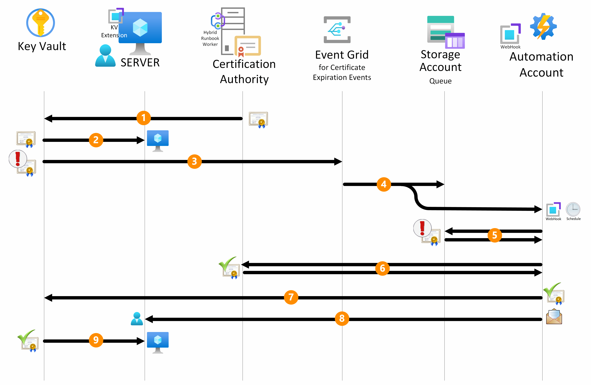
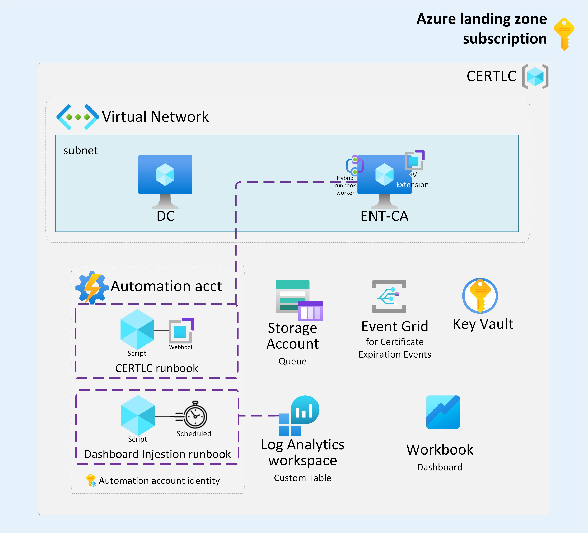
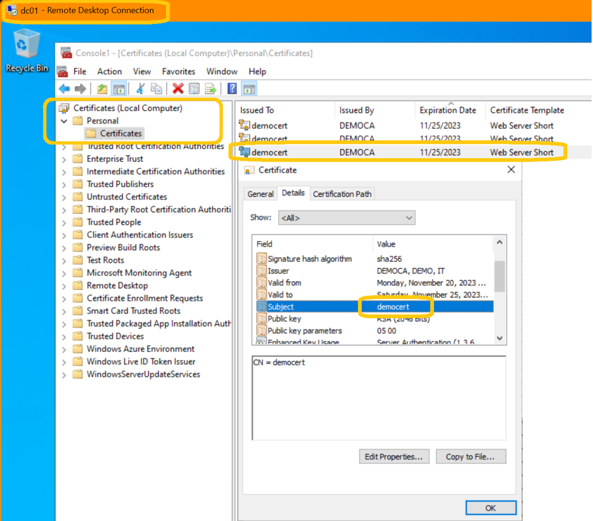

# Certificate Lifecycle LAB Deployment
In this tutorial, you will learn how to deploy the LAB environment for the **Certificate Lifecycle on Azure** scenario. The goal is to showcase a comprehensive solution for the automated renewal of certificates issued by non-integrated Certificate Authorities.

To initiate the deployment of the LAB environment, verify to have the *Owner* role on the subscription then click on the **Deploy to Azure** button provided above. This action will trigger the deployment process within the Azure Portal. You will be prompted to provide input parameters.

> [!IMPORTANT]
> For resources such as key vaults, automation accounts and event-grid, which necessitate globally unique names, kindly replace the *`UNIQUESTRING`* placeholder with a unique string of your choice, following the resource's constraints (e.g., maximum character count, lowercase only, etc.).

Parameters that require your primary attention are listed in the table below:

| Parameter | Description | Default value |
|-----------|-------------|---------------|
| **Subscription** | The subscription where the resources will be deployed. | |
| **Resource Group** | The resource group where the resources will be deployed. | |
| **Region** | The region where the resources will be deployed. | |
| **Domain Administrator Password** | The password of the Active Directory domain administrator. | |
| **CA Admin Password** | The password of the certificate authority administrator. | |
| **Key Vault Name** | The name of the key vault. | DEMO-KV-*\<`UNIQUESTRING`>* |
| **Event Grid Name** | The name of the event grid system topic. | DEMO-EG-*\<`UNIQUESTRING`>* |
| **Storage Account Name** | The name of the storage account. | demosa*\<`UNIQUESTRING`>* |
| **Automation Account Name** | The name of the automation account. | DEMO-AA-*\<`UNIQUESTRING`>* |

Additional parameters needed for the deployment can be left to their default values for the purpose of this LAB. Those parameters are listed in the table below:

| Parameter | Description | Default value |
|-----------|-------------|---------------|
| **Virtual Network Address Range** | The address range of the virtual network. | 10.0.0.0/16 |
| **Virtual Network Name** | The name of the virtual network. | ad-vnet |
| **Subnet Name** | The name of the subnet. | ad-vnet-subnet |
| **Subnet Range** | The address range of the subnet. | 10.0.0.0/24 |
| **Domain Name** | The name of the Active Directory domain to be created. | demo.com |
| **Domain Administrator User Name** | The name of the Active Directory domain administrator. | demoadmin |
| **DC VM Size** | The size of the domain controller virtual machine. | Standard_D2s_v3 |
| **DC VM Name** | The name of the domain controller virtual machine. | dc01 |
| **DC private IP Address** | The private IP address of the domain controller virtual machine. | 10.0.0.4 |
| **CA VM Size** | The size of the certificate authority virtual machine. | Standard_D2s_v3 |
| **CA VM Name** | The name of the certificate authority virtual machine. | ca01 |
| **CA Admin User Name** | The name of the certificate authority administrator. |caadmin |
| **Webhook Name** | The name of the webhook. | clc-webhook |
| **Worker Group Name** | The name of the Hybrid Worker Group. | EnterpriseRootCA |
| **Recipient** | The email address of the recipient to be notified when a certificate is renewed and available on the key vault. | john.doe@demo.com |
| **Webhook Expiry Time** | The expiry time of the webhook. | 1 year |
| **Schedule Start Time** | The start time of the scheduled runbook job. | Initial start time with a recurrence of 6 hours |
| ***_Current Date Time In Ticks*** | The current date time in ticks. This parameter is used to generate unique strings to use during the deploy of role assignments.| [utcNow('yyyy-MM-dd')] |

> [!NOTE]
> The deployment process is expected to take approximately 25 minutes to complete.

## LAB environment description
The LAB environment is designed to represent an in-depth technical overview of an automated renewal process for certificates from non-integrated CAs, which embodies the entire workflow shown below.

The LAB environment is structured to showcase the seamless workflow, allowing for a complete demonstration of the automated certificate management process. Let's delve into the key components, shown in the diagram below, constituting this environment:

1. **Virtual Network and Machines:**

    - A virtual network housing a /24 subnet accommodating two virtual machines.
    - One virtual machine acts as the domain controller for the Active Directory, simulating the server that receives the renewed digital certificate at the conclusion of the workflow.
    - Another virtual machine serves as the Public Key Infrastructure (PKI), running the Microsoft Certificate Services configured as the Enterprise Root Certification Authority (CA). The CA is set up with a certificate template issuing certificates with a 5-day validity, tailored for continuous activation within the demo environment.
    
    > [!NOTE]
>
> The CA virtual machine is configured also as an SMTP server to allow for email communication in this demo environment.
     
1. **Key Components:**

    - A **Key Vault** housing the initial certificate and all its renewals issued by the CA.
    - An **Event Grid System Topic** triggered by the Key Vault nearing the certificate expiration. This event triggers a Webhook, initiating the execution of a RunBook.
    - A **Storage Account Queue** used to store the certificate information, which is then retrieved by the RunBook.
    - An **Automation Account** defining:
        - The PowerShell script-based RunBook.
        - Associated Webhook for the RunBook.
        - The Hybrid Worker Group containing the CA as a Hybrid RunBook Worker.
        - Variables defining the SMTP server for email communication.

1. **RunBook Execution Steps on the CA as a Hybrid RunBook Worker:**
    The RunBook performs the following steps:

    - Reads the Key Vault name and the expiring certificate's details from the webhook body triggered by the Event Grid.
    - Connects to Azure to retrieve certificate data from the Key Vault.
    - Extracts certificate template OID information and recipient email addresses defined within the certificate's "Recipient" tag.
    - Requests a new CSR (Certificate Signing Request) from the Key Vault to be submitted to the CA.
    - Connects to the CA, requests a certificate with the previously obtained CSR, and presents it within the Key Vault to conclude the renewal process.
    - Sends emails to the identified recipients.

    > [!NOTE]
    > The RunBook performs the actions described above on Azure, using the System Managed Identity of the automation account, and inside the Certification Authority, using the system account (domain computer account) of the CA server.  To access the Azure Key Vault, the System Managed Identity of the automation account has been granted the "*Key Vault Certificate Officer*" role on the Key Vault.

1. **Certificate Retrieval:**
    The DC01, configured as the server expecting the renewed certificate via the Key Vault extension, receives the certificate in its machine's personal certificate store after the polling period elapses.

    > [!NOTE]
    > To access the Azure Key Vault, the System Managed Identity of the DC01 virtual machine has been granted the "*Key Vault Secret User*" role on the Key Vault. 

1. **Conclusion of the Demo:**
    At this stage, the demonstration concludes successfully.

1. **Real-World Implementation:**
    In a real-world scenario, an additional step is required to bind the certificate to the respective service (e.g., binding the certificate to IIS for a web certificate).

## Executing the Certificate Lifecycle in the LAB environment
The LAB is fully automated and requires no manual intervention. The following steps are provided to verify the whole process and to showcase the seamless workflow.

1. **LAB environment deployment:**
    The LAB environment is deployed using the ARM template provided in this repository. 
    Connect to the Domain Controller VM via RDP using the credentials provided during the deployment process. Use this VM as a jumpbox to connect to the CA VM with the same credentials (member of Domain Admins group) used to connect to the DC.

    

1. **Certificate Creation:**
    The certificate is created and stored in the Key Vault. The certificate is configured with a 5-day validity, and the Key Vault is configured to trigger the Event Grid when the certificate is nearing expiration.
    Open the KeyVault an select the Certificate Section. You should see the certificate created by the deployment named "*democert*".

    

    > [!NOTE]
    >  To access the certificate section you need at least the "Key Vault Certificate Officer" role on the Key Vault.
    

1. **Certificate Near Expiration**
    The certificate is nearing expiration, and the Key Vault triggers the Event Grid, which in turn triggers the Webhook, initiating the execution of the RunBook.
    Open the Event Grid System Topic and select the Subscriptions Section. You should see the "*CertLC*" subscription, select it to see the URL of the Webhook created by the deployment. The graph should show the events generated by the Key Vault that correspond to the triggering of the Webhook.

    

1. **RunBook Execution**
    The RunBook is executed on the CA as a Hybrid RunBook Worker. At the end of the execution, the certificate is renewed and stored in the Key Vault and an email is sent to the recipient.
    Connect to the CA VM and open the Certificate Server Console. Select "*Issued Certificate*" and you should see the renewed certificate.
    
    

    Open the MailViewer tool provided on the desktop of the CA server (which also serves as an SMTP server in this LAB) and select the most recent ".eml" file. You should see the email sent by the RunBook to the recipient defined in the certificate's "Recipient" tag.

    

1. **Certificate Retrieval**
    At this stage, the certificate is renewed and stored in the Key Vault.

    

    The tag "*Recipient*" is maintained in the new certificate object inside the Key Vault. 

    

    The DC01, configured as the server expecting the renewed certificate via the Key Vault extension, receives the certificate in its machine's personal certificate store after the polling period elapses.
    Connect to the DC VM and open the Certificate Manager Console. Select "Personal" and you should see the renewed certificate.

    

